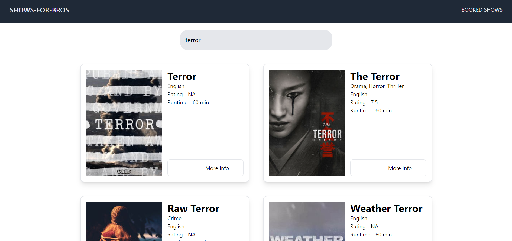

# shows-for-bros

It is a React application that allows users to explore and search for TV shows using the TVMaze API. Users can view a list of TV shows, get more details about each show, and even book tickets for their favorite shows.

## Features

- **Search Functionality:** Use the search bar to find your favorite TV shows quickly.
- **Show Details:** Click on a show to view more details, including genres, language, rating, and runtime.
- **Book Tickets:** Book tickets for your preferred shows. Your bookings are stored locally using localStorage.

## Getting Started

1. **Clone the Repository:**
   ```git clone https://github.com/the-jatin-singh/shows-for-bros```
2. **Install Dependencies:**
   ```npm install```
3. **Run the Application:**
   ```npm run dev```
4. **Open in Browser:**
   Open ```http://localhost:5173/``` in your web browser.

## Usage
- Enter the name of a TV show in the search bar to find relevant shows.
- Click on a show to view detailed information.
- Book tickets for your favorite shows by clicking the "Book a Ticket" button.

##Dependencies
- Vite
- React Router
- DOMPurify (for sanitizing HTML content)

## Project Structure
- src/components: Contains React pages and components for different parts of the application.
- src/App.js: Main application component.
- src/index.js: Entry point of the application.
